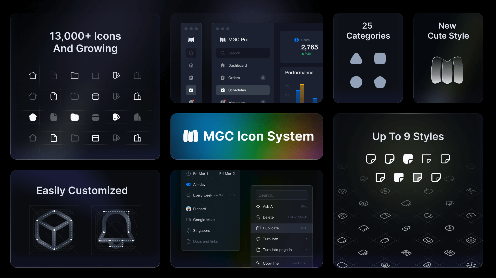
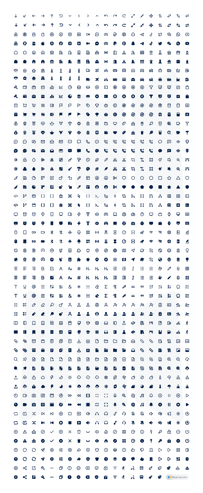

[](https://www.zxeicnreact.com/)
[](https://www.npmjs.com/package/ZxeiCnReact)
[](https://github.com/ZxeiCnReact/ZxeiCnReact/stargazers)
[](https://www.npmjs.com/package/ZxeiCnReact)
[](https://twitter.com/ZxeiCnReact)

# ZxeiCnReact Icon

ZxeiCnReact is a set of simple and exquisite open-source icon library. Whether you're a designer or a developer, it's perfect for use in web and mobile.Every icon is designed within a 24 x 24 grid, giving outline and filled styles, 2px stroke. Support for SVG,PNG and webfont.

## Usage
### Website

Head on to the website of [ZxeiCnReact](https://www.zxeicnreact.com/). Click the icons, you can adjust the color size, and then download the icons in SVG or PNG format. 

### Installation

Install npm package:

```shell
npm install ZxeiCnReact --save
```

Import CSS styles into the project entry file:

```js
// main.js
import 'ZxeiCnReact/font/ZxeiCnReact.css'
```

Overwrite the initial color of the icon in the global style file:

```css
// index.css
[class^='zxei_']::before,
[class*=' zxei_']::before {
  color: inherit !important;
}
```

## React Components

For React projects, you can use our dedicated React component library:

```shell
# Using npm
npm install ZxeiCnReact

# Using yarn
yarn add ZxeiCnReact

# Using pnpm
pnpm add ZxeiCnReact
```

### Basic Usage

```jsx
import { AddCircleFill, AddCircleLine } from 'ZxeiCnReact';

const App = () => {
  return (
    <div>
      <AddCircleFill />
      <AddCircleLine size={32} color="red" />
    </div>
  );
};
```

### Optimized Imports

For better tree-shaking, import from subpaths:

```jsx
import { AddCircleFill } from 'ZxeiCnReact/react';
```

For more detailed usage examples and available props, please check [README-zh.md](./README-zh.md).

## Webfont

Copy the font files from  `/fonts` and import the `ZxeiCnReact.css` file. Add icon with class name, class name rule: zxei_{name}_{style}

```html
<span class="zxei_search_line"></span>
<span class="zxei_search_fill"></span>
```

## Figma Plug

[](https://www.figma.com/community/plugin/zxeicnreact-icon)

[ZxeiCnReact Icons Figma plugin](https://www.figma.com/community/plugin/zxeicnreact-icon)

## ZXR Icon System

[](https://zxr.zxeicnreact.com)

[ZXR Icon System](https://zxr.zxeicnreact.com) is a comprehensive collection of over 13,600 high-quality vector icons across nine styles: cute light, cute regular, cute filled, sharp, light, regular, filled, duotone, and two-tone.It is an upgraded version of ZxeiCnReact.

## Animation

[](https://www.zxeicnreact.com/animation)

We have launched the [ZxeiCnReact animation icons pack](https://www.zxeicnreact.com/animation), which is a meticulously designed library of animated icons featuring lifelike lottie animations.

## Preview


## License
ZxeiCnReact icon is available under [Apache-2.0 License](./LICENSE). Feel free to use the set in both personal and commercial projects. Attribution is much appreciated but not required. The only thing we ask is that these icons are not for sale.

